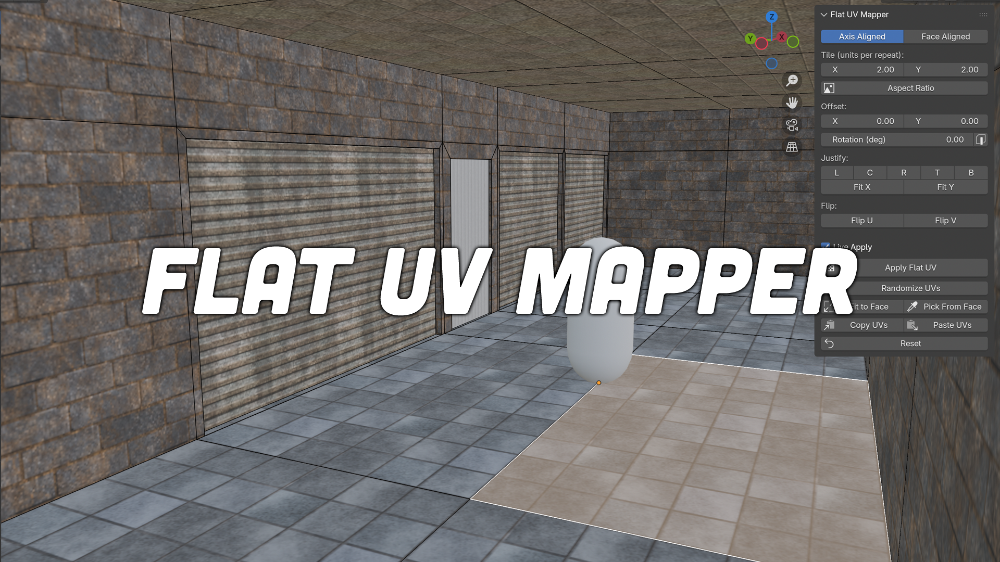

# Flat UV Mapper

**Flat UV Mapper** is a Blender add-on that brings a rapid, CSG-style (e.g., Source Engine / Hammer Editor) planar face UV mapping workflow directly into Blender. It allows you to quickly apply, scale, align, and manipulate planar UV maps on selected faces without ever needing to open the UV Editor.

## Features

- **Projection Modes:**
  - **Axis Aligned:** World-axis planar projection (Hammer/CSG style).
  - **Face Aligned:** Project along the face normal.
- **Adjustments & Flipping:** Control Tile size (X/Y), Offset (X/Y), Rotation, and easily flip the texture horizontally or vertically (Flip U / Flip V).
- **Live Apply:** Reproject automatically when values change for instant visual feedback.
- **Copy & Paste UVs:** Instantly copy UV offsets, scales, and rotations from one face and paste them onto others.
- **Justification & Alignment:** Quickly snap your texture to the Top, Bottom, Left, Right, or Center of a face, or fit it to the X or Y bounds.
- **Aspect Ratio Compensation:** Automatically adjust UV tiling to match the aspect ratio of your active material's texture, preventing stretching.
- **Align to Edge:** Select an edge and automatically rotate your UVs to align perfectly with it.
- **Randomize UVs:** Break up obvious repeating patterns on large surfaces with randomized UV offsets and rotations.
- **Pie Menu:** Lightning-fast access to all tools via a dedicated Pie Menu (Default: `Shift + Alt + U`).

## Requirements

- Blender 4.2.0 or newer.

## Installation

1. Download the repository as a ZIP file or clone it.
2. In Blender, go to **Edit > Preferences > Add-ons**.
3. Click the downward arrow in the top right and select **Install from Disk...**
4. Select the `.zip` file.
5. Enable the add-on by checking the box next to **Flat UV Mapper**.

## Usage

1. Enter **Edit Mode** on a Mesh object.
2. Open the Sidebar (press `N`) and navigate to the **Flat UV** tab, or press `Shift + Alt + U` to open the Pie Menu.
3. Select the faces you want to map.
4. Adjust the projection mode, tile, offset, rotation, and flips. If **Live Apply** is checked, changes will be visible immediately.
5. Use the various alignment and utility operators to fine-tune your mapping!

## License

This project is licensed under the [GPL-3.0-or-later](LICENSE) license.